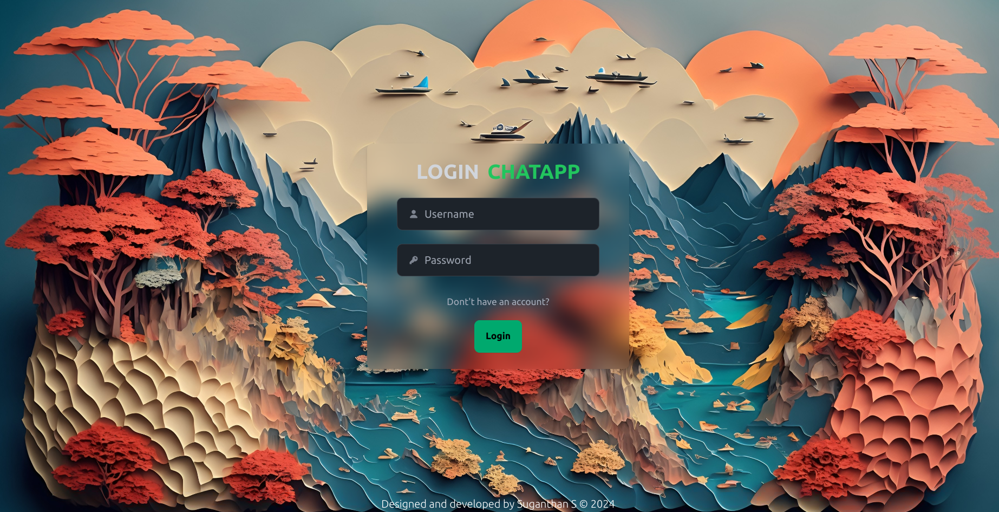
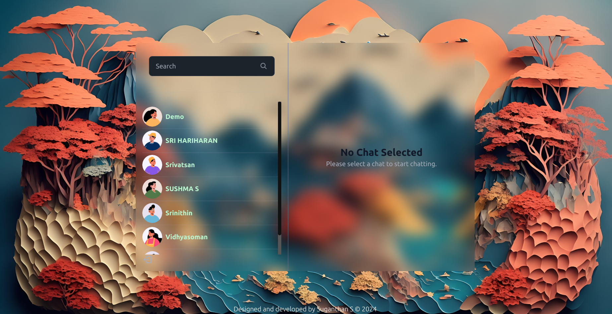
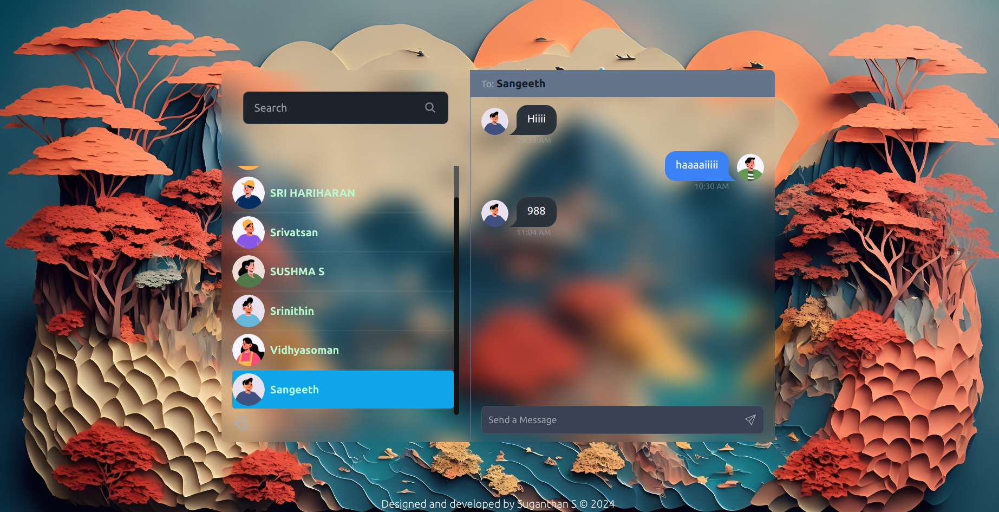
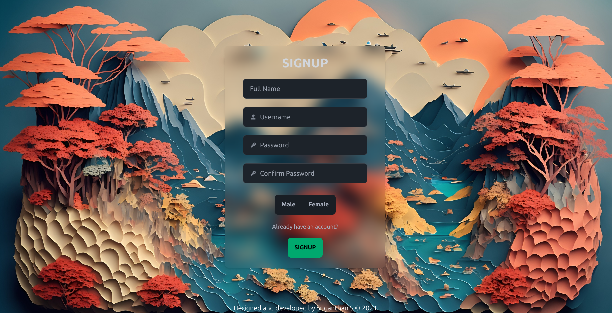

# Real-Time Chat Application

This is a real-time chat application built with React, Tailwind CSS, DaisyUI, Socket.IO, MongoDB, JWT authentication, Node.js Express, and Zustand for state management.

## Introduction

This application allows users to engage in real-time chat conversations. It provides a user-friendly interface built with React and Tailwind CSS, while Socket.IO facilitates real-time communication between clients and the server. MongoDB is used as the database to store chat messages and user data, and JWT is employed for authentication.

## Features

- User authentication using JWT tokens
- Real-time chat messaging
- Responsive design with Tailwind CSS and DaisyUI
- State management using Zustand
- MongoDB database for storing chat data

## Technologies Used

- React
- Tailwind CSS
- DaisyUI
- Socket.IO
- MongoDB
- JWT
- Node.js Express
- Zustand

## PICTURES

## Hosted on : https://chat-app-270k.onrender.com/
